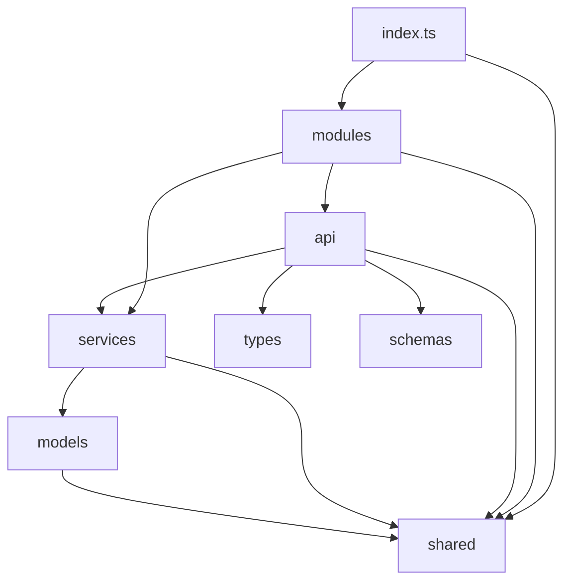

# Dribbble Research User Service

[[_TOC_]]

## Развернуть локально
1. Установить и запустить PostgreSQL локально
   - [Для Windows](https://www.postgresqltutorial.com/install-postgresql/)
   - [Для OSX](https://www.postgresqltutorial.com/install-postgresql-macos/)
   - [Для Linux](https://www.postgresqltutorial.com/install-postgresql-linux/)
1. Скопировать файл `.env_template` в `.env`. По необходимости заменить переменные окружения на свои
1. Выполнить в терминале `npm i` - подтянутся необходимые зависимости
1. Выполнить в терминале `npm run dev` - запустится сборка исходников в режиме наблюдения за изменениями и сервер на порту, указанном в `.env`

## Архитектура
```
/src - Исходный код проекта
    - /api - API приложения. Каждый файл - функция, которая принимает в качестве первого аргумента инстанс Fastify и устанавлиает обработчики на нужные эндпоинты
    - /models - Описание сущностей базы данных
    - /modules - Основные модули системы
    - /schemas - Схемы запросов/ответов сервера в формате json
    - /services - Основная бизнес-логика приложения. Каждый сервис реализует свою часть бизнес-логики и может манипулировать моделями базы данных
    - /shared - Общий код всего приложения. Например, утилитарные функции
    - /types - Схемы запросов/ответов сервера в формате интерфейсов Typescript 
```



## Документация API
Документация API находится в файле api_doc.html. Его можно открыть в браузере и в удобном виде посмотреть на нужные эндпоинты, запросы, ответы
